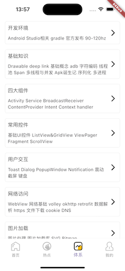

# one_android_flutter dart3.5.3+Flutter3.24.3
通过玩安卓app网站的开放接口，用flutter实现的相关项目

## 其他一些学习练手的项目

Flutter版本开眼App链接(getx+retrofit+dio+jsonserialize+自定义控件demo)：https://github.com/WinWang/open_eye

Flutter版本的音乐播放App链接(getx+retrofit+dio)：https://github.com/WinWang/music_listener

ReactNative版本的开眼App链接(ReactNative-0.72)：https://github.com/WinWang/RNOpenEye

React版本的开眼App链接(React18+React-Vant+Mobx+axios)：https://github.com/WinWang/react-oepn-eye

Vue2版本WanAndroid链接(Vue2+vuex+vant+axios)：https://github.com/WinWang/Vue-WanAndroid

Vue3版本WanAndroid链接(vue3+typeScript+pinia+vant+vite)：https://github.com/WinWang/Vue3-wanAndroid

Android组件化项目ReadingGallery链接(jetpack+kotlin+koin+couroutine)：https://github.com/WinWang/ReadingGallery

Android组件化项目初始化工具ApplicationInit链接(gradle-plugin+注解APT+ASM)：https://github.com/WinWang/ApplicationInit

## android下载地址
[演示app下载地址](https://www.pgyer.com/gJjTehFC)

## 项目演示图片

首页

热词

体系

我的

我的收藏

